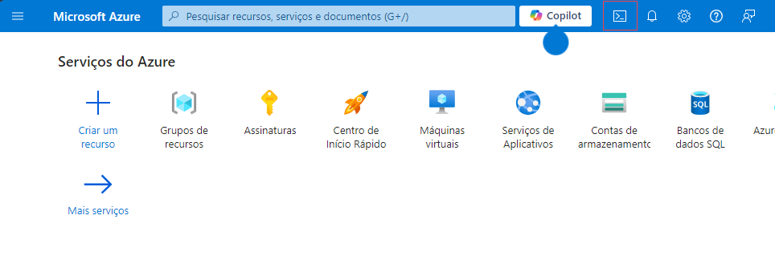

# Exercício 1: Usar Open AI para Inserir dados em Bulk, Executar Operações Inteligentes, e Analisar Dados com Synapse

### Sumário

Esse cenário permite o uso do OpenAI para resumir e analisar os logs de chamadas de atendimento ao cliente para a empresa fictícia - Contoso. Os dados são inseridos numa blob storage account e, em seguida, processados por uma Azure Function. Baseado no texto do log das chamadas, a Azure Function retornará o sentimento do cliente, o produto sobre o qual a conversa foi abordada, o tópico da chamada, bem como um resumo da chamada. Esses resultados são gravados em um local separado em blob storage. A partir daí, o Synapse Analytics é utilizado para extrair os dados e para criar uma tabela que pode ser consultada para obter mais informações.

---
# Índice
- [Usar Open AI para Inserir dados em Bulk, Executar Operações Inteligentes, e Analisar Dados com Synapse](#build-an-open-ai-pipeline-to-ingest-batch-data-perform-intelligent-operations-and-analyze-in-synapse)
- [Sumário](#summary)
- [Índice](#table-of-contents)
- [Diagrama de Arquitetura](#architecture-diagram)
- [Implantação](#deployment)
    - [Tarefa 1. Inserir Dados no Storage criado no passo 1](#step-1-Ingest-Data-to-Storage-account)
    - [Tarefa 2. Configurar o Synapse Workspace](#step-3-set-up-synapse-workspace)
        - [a. Lançar o Azure Cloud Shell](#a-launch-azure-cloud-shell)
        - [b. No Cloud Shell execute os seguintes comandos:](#b-in-the-cloud-shell-run-the-below-commands)
        - [c. Criar tabela SQL de destino](#c-create-target-sql-table)
        - [d. Criar a Origem e Destino em Linked Services](#d-create-source-and-target-linked-services)
        - [e. Criar Fluxo de dados em Synapse](#e-create-synapse-data-flow)
        - [f. Criar um Pipeline em Synapse](#f-create-synapse-pipeline)
        - [g. Executar um Pipeline em Synapse](#g-trigger-synapse-pipeline)
    - [Tarefa 3. Resultados da Consulta na Nossa Tabela SQL ](#step-4-query-results-in-our-sql-table)


# Diagrama de Arquitetura

   

Os registros de chamadas são enviados para blob storage. Este envio aciona um Azure Functions, que usa o [Azure OpenAI Service](https://azure.microsoft.com/en-us/products/cognitive-services/openai-service/) para a sumarização, análise de sentimento, identificar o produto discutido na conversa, o tópico da chamada, bem como um resumo da chamada. Esses resultados são escritos novamente em blob storage. A partir daí, o Synapse Analytics é utilizado para importar os novos dados e criar uma tabela que pode ser consultada para obter mais Informações.

## Tarefa 1: Inserir Dados em Storage account

### A. Lançar o Azure Cloud Shell

1. No [Portal de Azure](https://portal.azure.com?azure-portal=true), selecione o botão **[>_]** (*Cloud Shell*) que se encontra no topo da página a direita da pesquisa. O painel do Cloud Shell irá abrir na parte inferior do portal.

    

2. Na primeira vez que abrir o Cloud Shell, pode ser solicitado que escolha o tipo de shell que deseja usar (*Bash* ou *PowerShell*). Selecione **Bash**. Se esta opção não abrir pode avançar para o próximo passo.

3. No painel Getting Started, selecione **Mount storage account (1)**, selecione **Storage account subscription (2)** na lista de opções e selecione **Apply (3)**.

   .png)

4. No painel **Mount storage account**, selecione **Select existing storage account (1)** e clique **Next (2)**.

   .png)

5. No painel **Advanced settings**, introduza os seguintes detalhes:

    - **Subscription**: Default- Escolha a única assinatura existente atribuída para este laboratório. (1).
    - **Resource group**: Selecione **Use existing** **(2)**
      - openai-<inject key="DeploymentID" enableCopy="false"></inject>
    - **Storage account**: Selecione **Use existing** **(3)**
      - openaistorage<inject key="DeploymentID" enableCopy="false"></inject>
    - **File share**: Create a new file share **(4)**

      .png)

1. Introduza o nome para a file share **blob (1)**, e selecione **Select (2)**.

    .png)

1.  Assim que a storage account for criada, a janela Bash será exibida, conforme mostrado na capura de tela abaixo.
    
    

### B. Carregar arquivos para a storage account:

1. Execute os seguintes comandos no Cloud Shell para fazer download e instalar o Miniconda. 

     ```bash 
     wget https://repo.anaconda.com/miniconda/Miniconda3-py39_23.1.0-1-Linux-x86_64.sh 
     ```

     ```bash 
     sh Miniconda3-py39_23.1.0-1-Linux-x86_64.sh 
     ```
    
    > **Nota:** Os seguintes comandos são executados em Bash; certifique-se de que está a usar **Bash** na Cloud Shell.
    
    > **Nota:** Pressione a tecla de seta para baixo para ler ou ignorar o acordo de licença.

1. Digite **yes** e pressione **enter** para aceitar o acordo, e pressione enter para instalar na pasta padrão.

   

1. Digite **yes** e pressione **enter** para inicializar o ambiente conda.

    

1. Execute o seguinte comando para armazenar o caminho de instalação do miniconda em uma variável.

    ```bash 
    export PATH=~/miniconda3/bin:$PATH
    ```
1. Execute o seguinte comando para criar e ativar o ambiente conda na Cloudshell.

    ```bash 
    git clone https://github.com/microsoft/OpenAIWorkshop.git
    cd OpenAIWorkshop/scenarios/openai_batch_pipeline/document_generation
    conda create -n document-creation
    conda activate document-creation
    pip install --upgrade pip
    pip install -r reqs.txt
    ```
    > **Nota**: se receber o erro **"Conda: command not found"**, feche a sessão de CloudShell e abra uma nova sessão para continuar.
    
1. Digite **y** e pressione enter para prosseguir.

1. No [Portal de Azure](https://portal.azure.com), navegue para a Storage Account com o sufixo `functions` selecionando o **openai-<inject key="DeploymentID" enableCopy="false"/>** resource group e selecione a Storage Account da lista de recursos.

    
    
1. Mude para a janela **Access keys (1)** e selecione **Show (2)**, que está ao lado do valor da Connection String. Selecione o botão de copiar para a primeira **connection string (3)**. Cole o valor em um editor de texto, como o Notepad.exe, para referência futura."

   

1. Volte para a sessão Bash da Cloud Shell e execute o comando abaixo para fazer o upload dos arquivos JSON para a storage account, substituindo a <CONNECTION_STRING> copiada na etapa anterior. Este passo irá demorar alguns minutos para ser concluído.

    ```bash 
    python upload_docs.py --conn_string "<CONNECTION_STRING>"
    ```

   

   > **Nota**: Execute "cd OpenAIWorkshop scenarios/openai_batch_pipeline/document_generation" se não estiver na pasta OpenAIWorkshop/scenarios/openai_batch_pipeline/document_generation.

1. Depois de fazer o upload dos arquivos JSON para a storage account com sucesso, pode navegar até a storage account no portal de Azure e verificar se os arquivos foram carregados.   

   

## Tarefa 2: Configurar o Synapse Workspace

### **A. Criar tabela SQL de destino**

1. No [Portal de Azure](https://portal.azure.com), navegue até ao synapse workspace **asaworkspace<inject key="DeploymentID" enableCopy="false"/>**  no resource group **openai-<inject key="DeploymentID" enableCopy="false"/>**. Na aba **Overview**, clique em **Open** para iniciar o Synapse workspace.

    

1. Clique na secção **Develop (1)** no Synapse Studio, clique em **+ (2)** sign in no topo esquerdo, e selecione **SQL script (3)**. Isto abrirá uma nova janela com um editor de script SQL. 

   

1. Copie e cole o seguinte script no editor **(1)**, em seguida, altere o valor **Connect to** selecionando **openaisql (2)** a partir da lista suspensa, e para **Use database**, confirme que **openaisql (3)** está selecionado, e clique no botão **Run (4)** no canto superior esquerdo, como mostra a imagem abaixo. Conclua esta etapa pressionando **Publish all (5)** logo acima do botão **Run** para publicar nosso trabalho até agora.

    ```SQL 
    CREATE TABLE [dbo].[cs_detail]
    (
    interaction_summary varchar(8000),
    sentiment varchar(500),
    topic varchar(500),
    product varchar(500),
    filename varchar(500)
    )
    ```
    
    
    
1. Em seguida, clique em **Publish** para publicar o script SQL.

    

### **B. Criar a Origem e Destino em Linked Services**

Em seguida, precisaremos criar dois linked services: um para nossa origem (os arquivos JSON no Data Lake) e outro para o Banco de Dados SQL Synapse que contem a tabela que criamos na etapa anterior.

1. Clique novamente na seção **Manage (1)** do Synapse Studio e clique na opção **Linked services (2)** na seção **External connections**. Em seguida, clique em **+ New (3)** no canto superior esquerdo.

   
   
1. Somece criando os linked services para a nossa fonte de dados, usando os arquivos JSON alojados no armazenamento ADLS Gen2 que criamos com nosso modelo inicial. Na barra de pesquisa que é aberta depois de clicar em Novo, procure **blob (1)**, selecione **Azure Blob Storage (2)** conforme descrito abaixo e clique em **Continue (3)**.

   

1. Forneça o nome do seu linked service como **openailinkedservice (1)**. Altere o **Authentication type** para **Account key (2)**. Em seguida, selecione a **subscription (3)** em que você está trabalhando e, finalmente, selecione a storage account com o sufixo **functions (4)** que você criou no modelo inicial e carregou os arquivos JSON em seguida, clique em **Test connection (5)**. Quando a conexão for bem-sucedida, clique no botão **Create (6)** em azul no canto inferior esquerdo da janela novo linked service.

   

1.  Clique em **+ New** no canto superior esquerdo. Procure **Synapse (1)**, selecione **Azure Synapse Analytics (2)**, e clique em **Continue (3)**.

     

1. Na janela *New linked service* que se abre, preencha um nome para o target linked service como **synapselinkedservice** **(1)**. Selecione a **Azure subscription (2)**  na qual você tem trabalhado. Selecione **asaworkspace<inject key="DeploymentID" enableCopy="false"/> (3)** para **Server name** e **openaisql (4)** como o **Database name**. Certifique-se de alterar o **Authentication type** para **System Assigned Managed Identity (5)**, depois clique em **Test connection (6)** e clique em **Create (7)**.

    

1. Depois de criar os dois linked services, certifique-se de pressionar o botão **Publish all** na parte superior para publicar o nosso trabalho. Finalize a criação dos linked services e clique em **Publish**.

   
   
### **C. Create Synapse Data Flow**

Ainda dentro do Synapse Studio, agora precisaremos criar um **Data flow** para inserir os nossos dados JSON e gravá-los em nosso banco de dados SQL. Para este workshop, este será um fluxo de dados muito simples que insere os dados, renomeia algumas colunas e os grava de volta na tabela de destino.

1. Primeiro, vamos querer voltar para o separador **Develop (1)**, selecionar **+ (2)**, e depois **Data flow (3)**.

   
   
1. Quando o editor de fluxo de dados abrir, clique em **Add Source**. Uma nova janela será aberta na parte inferior da tela. Selecione **+ New** na linha **Dataset** deixando as outras opções como padrão.

   

1. Uma nova janela deve ser aberta no lado direito da tela. Em seguida, procure por **Azure Blob Storage (1)**, selecione **Azure Blob Storage (2)**, e clique em **Continue (3)**.
   
   

1. Em seguida, selecione a opção **JSON (1)** pois os nossos dados de entrada estão no formato JSON e clique em **Continue (2)**.

   

1. Selecione o Linked Service com o nome **openailinkedservice (1)** que acabamos de configurar nas etapas acima. Você precisará selecionar a **File path** para escolher o diretório onde nossos arquivos JSON estão armazenados. Deve ser algo semelhante a **workshop-data / cleansed_documents (2)**. Clique no botão **OK** para fechar a janela.

   
   
1. Em seguida, precisaremos ir para o painel **Source options (1)** e listar as opções **JSON settings (2)**. Precisamos alterar a opção **Document form** para a configuração **Array of documents (3)**. Isso permite que nosso fluxo leia cada arquivo JSON como uma entrada separada em nosso banco de dados.

      

1. Ativar a opção **data flow debug** localizada na barra de menu superior adjacente ao botão validar e clique em **OK** na janela pop-up *Turn on data flow debug*.

    >**Nota:** Levará um ou dois minutos para que a sessão **data flow debug** seja ativada.

1. Navegue até ao separador **Data preview** e execute uma visualização para verificar seu trabalho até agora.
    
    

    >**Nota**: Se não conseguir visualizar os dados no separador Data Preview, clique no botão Atualizar até os dados aparecerem.
   
1. Em seguida, podemos adicionar no nosso bloco **Select** e fazer nossas pequenas alterações antes de gravar os dados na tabela Synapse SQL. Para começar, clique no pequeno sinal **+ (1)** ao lado do nosso bloco de ingestão e escolha a opção **Select (2)**.

   

1. Podemos deixar todas as configurações como padrão. Em seguida, adicionaremos nosso bloco **Sink**. sta é a etapa que gravará nossos dados em nosso banco de dados Synapse SQL. Clique no pequeno sinal **+ (1)** o lado do nosso bloco **Select**. até a parte inferior do menu de opções e selecione a opção **Sink (2)**.

   

1. Quando o bloco **Sink (1)** abrir, escolha **Inline (2)** para o *Sink type*. Em seguida, selecione **Azure Synapse Analytics (3)** para o *Inline dataset type*, e para o **Linked service**, selecione **Synapselinkedservice (4)**, que foi criado na etapa anterior. Certifique-se de executar **Test connection (5)** para o linked service.

   

   > **Nota**: Se a conexão de teste demorar mais de 3 a 4 minutos, siga as etapas abaixo.

   - Clique em **Edit**.

         

   - Na janela Editar linked service que é aberta, selecione o método de seleção do Azure como **From Azure subscription** **(1)**. Selecione a **Azure subscription (2)** para a qual você tem trabalhado. Selecione **asaworkspace<inject key="DeploymentID" enableCopy="false"/> (3)** para **Server name** e **openaisql (4)** como o **Database name**, clique em **Test connection (5)** e clique em **Save (6)**.

     

1. Em seguida, precisaremos ir para o separador **Settings (1)** e ajustar o **Schema name** e **Table name**. Se você utilizou o script fornecido anteriormente para criar a tabela de destino, o nome do esquema é **dbo (1)** e o nome da tabela é **cs_detail (2)**.

    

1. Antes de terminarmos nosso trabalho sobre o data flow, devemos visualizar nossos dados. A pré-visualização dos nossos dados revela que só temos 3 colunas quando esperamos um total de 5. Perdemos as nossas colunas Summary e Sentiment.

    

1. Para corrigir isso, vamos usar nosso bloco **Select (1)** para alterar os nomes da seguinte forma para obter os valores de saída esperados:

     - **Summary**: `interaction_summary` **(2)**
     - **CustomerSentiment**: `sentiment` **(3)**

        
    
1. Retornando ao bloco **Sink (1)** por baixo de **Data preview (2)** clique **Refresh (3)**, vamos agora ver as 5 colunas que são esperadas.

    

1. Depois de revisar os dados e estar satisfeito que todas as colunas foram mapeadas com êxito (você deve ter 5 colunas no total, todas mostrando dados em um formato tipo string), podemos selecionar **Publish all** na parte superior para salvar nossa configuração atual. Uma janela será aberta no lado direito da tela; pressione o botão azul **Publish** na parte inferior esquerda para salvar suas alterações.

    

1. O seu Data flow  concluído e salvo terá a seguinte aparência:

    

### **D. Criar um Pipeline em Synapse**

1. Depois de criarmos o nosso **Data flow**, precisaremos configurar um **Pipeline** para alojar o Data Flow. Para criar um **Pipeline**,  navegue até a barra de menu à esquerda e escolha a opção **Integrate (1)**. Em seguida, clique no botão **+ (2)** a parte superior do menu Integrate para **Add a new resource** e escolha **Pipeline (3)**.

   

2. Em seguida, precisamos adicionar um **Data flow** ao nosso Pipeline. Com o novo separador **Pipeline tab (1)** aberto, vá para a seção **Activities** e procure por `data` **(2)** e selecione a atividade **Data flow (3)** e **drag-and-drop (4)** no seu Pipeline.

   

3. No separador **Settings (1)** do **Data flow**, selecione o menu **Data flow (2)** e selecione o nome do fluxo de dados criado na etapa anterior. 
Em seguida, expanda a seção **Staging (3)** na parte inferior das configurações e utilize o menu suspenso para o **Staging linked service**. Escolha o linked service que você criou **openailinkedservice (4)** para garantir a **Test connection (5)**. Em seguida, defina uma **Staging storage folder** na parte inferior e digite **workshop-data/Staging** **(6)**.

   

4. Em seguida, clique em **Publish all** para publicar as alterações efetuadas e salvar o seu progresso.

### **E. Executar um Pipeline em Synapse**

1. Depois de publicar com sucesso o seu trabalho, precisamos iniciar o nosso pipeline. Para fazer isso, logo abaixo dos separadores na parte superior do Studio, há um ícone de *raio* que diz **Add trigger (1)**. Clique para adicionar um trigger e selecione **Trigger now (2)** para iniciar uma execução de pipeline e, quando a janela abrir, clique em **OK**.

    
    
2. Para ver a execução do pipeline, navegue até o lado esquerdo da tela e escolha a opção **Monitor (1)**. Em seguida, selecione a opção **Pipeline runs (2)** na seção **Integration**. Em seguida, você verá a execução do pipeline que você acionou na seção **Triggered (3)** como **pipeline 1 (4)**.  Este pipeline deve levar aproximadamente 4 minutos (se você estiver usando os dados carregados para o workshop).

   

## Task 3: Resultados da Consulta na Nossa Tabela SQL

1. Certifique-se de que o status de execução do pipeline tenha **Succeeded**.

    

2. Agora que os dados estão na tabela de destino, eles estão disponíveis para uso executando consultas SQL em relação a eles ou conectando o PowerBI e criando visualizações. A Azure Function também está em execução, portanto, tente carregar alguns dos arquivos de transcrição para a pasta generated_documents em seu container e veja como a função a processa e cria um novo arquivo na pasta cleansed_documents.

3. Para consultar os novos dados, navegue até o menu do lado esquerdo e escolha **Develop (1)**. Clique no **SQL Script (2)** existente e substitua o conteúdo pelo **SQL Code (3)** abaixo. Em seguida, selecione **openaisql (4)** pool **Run (5)**. 

     ```SQL 
    SELECT sentiment, count(*) as "Sum of Sentiment"
    FROM [dbo].[cs_detail]
    GROUP BY sentiment
    ORDER BY count(*) desc     
     ```

   - Os resultados da sua consulta, se você estiver usando os arquivos carregados como parte deste repositório ou do workshop, você verá **Results (6)** semelhantes aos abaixo.

      
