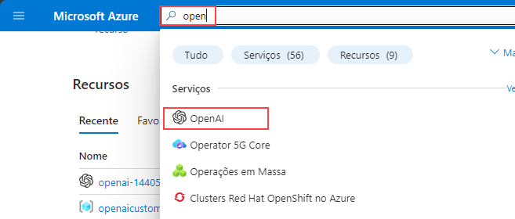
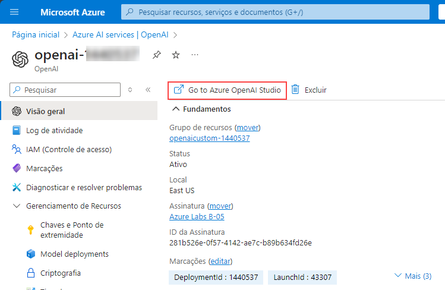
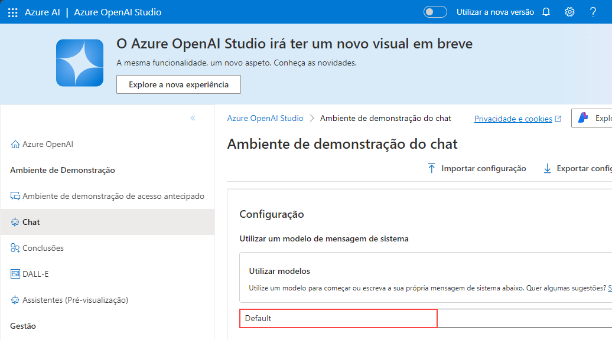

# Exercise 4a: Introduction to Prompt Engineering & Azure OpenAI Studio

In this exercise, you'll explore the concept of prompt engineering, learning how to craft effective prompts for AI models. You'll get hands-on experience with Azure OpenAI Playground, experimenting with different types of prompts and understanding their elements and design tips.

## Topics

- [O que é um prompt?](#what-is-a-prompt)
- [O que é prompt engineering?](#what-is-prompt-engineering)
- [Experimentando o Prompt Engineering com o Azure OpenAI Playground](#Trying-out-Prompt-Engineering-with-Azure-OpenAI-Playground)
- [Exemplos de prompt básicos](#basic-prompt-examples)
- [Elementos de um prompt](#elements-of-a-prompt)
- [Parâmetros do Chat playground](#Chat-playground-parameters)
- [Dicas gerais para criar prompts](#general-tips-for-designing-prompts)


## O que é um prompt?


Todos nós vimos o cursor piscando. Esperando ansiosamente por nós para agir, denotando a nossa chance de fornecer informações ...

Uma forma de pensar em um prompt é como um pedaço de texto que é usado para iniciar ou fornecer contexto para a geração de output, principalmente linguagem natural em nossos casos de uso, pelo modelo de linguagem. Isto pode ser uma frase de entrada, pergunta ou tópico para gerar uma resposta do modelo de linguagem.

## O que é prompt engineering?
Prompt engineering é uma [disciplina](https://www.businessinsider.com/prompt-engineering-ai-chatgpt-jobs-explained-2023-3) relativamente nova para desenvolver e otimizar prompts para usar eficientemente modelos de linguagem (LMs) em uma ampla variedade de aplicativos de negócios. Habilidades de prompt engineering ajudam a entender melhor as capacidades e limitações dos grandes modelos de linguagem (LLMs) e refinar as conclusões (outputs) de LLMs. Prompt engineering é usada para melhorar a capacidade dos LLMs em uma ampla gama de tarefas comuns e complexas, como resposta a perguntas e raciocínio aritmético. Os desenvolvedores usam prompt engineering para projetar técnicas de prompting robustas e eficazes que fazem interface com LLMs e outras ferramentas.

Este guia aborda os conceitos básicos de prompts padrão para fornecer uma ideia aproximada de como interagir e instruir os LLMs encontrados no [Playground do Azure OpenAI Studio](https://oai.azure.com/portal/playground).

###  Experimentando o Prompt Engineering com o Azure OpenAI Playground
O Azure OpenAI Studio fornece acesso a recursos de gerenciamento, implantação, experimentação, personalização e aprendizagem de modelos. O Chat Playground no Azure OpenAI Studio é baseado em uma interface de entrada e saída de mensagens. Você pode inicializar a sessão com uma mensagem do sistema para configurar o contexto do chat.

No Chat playground, você pode adicionar exemplos de few-shot. O termo few-shot refere-se a fornecer alguns exemplos para ajudar o modelo a aprender o que precisa fazer. Você pode pensar nisso em contraste com zero-shot, que se refere a não fornecer exemplos.

Na configuração do Assistente, você pode fornecer alguns exemplos do que pode ser a entrada do usuário e qual deve ser a resposta do assistente. O assistente tenta imitar as respostas que você inclui aqui no tom, nas regras e no formato que você definiu na mensagem do sistema.
Vamos agora iniciar o playground do Azure OpenAI para aprender mais sobre Prompt Engineering.

1. No **Portal de Azure**, pesquise por **OpenAI** e selecione **OpenAI**.

   

1. Na janela **Azure AI services | Azure OpenAI**, selecione **openai-<inject key="DeploymentID" enableCopy="false"/>**

1. No painel de recursos do Azure OpenAI, clique em **Go to Azure OpenAI Studio** ele navegará até **Azure AI Studio**.

   

1. No **Azure AI Studio**, clique em **Chat** sobre **Playground** no menu à esquerda..

    

1. Na seção **Chat**, escolha **default** **(1)** em use a system message template. Em seguida, faça qualquer consulta da **Chat session** **(2)** para obter a resposta do openai.

   >**Nota**: Clique em **Continue** no **Update system message?** quando solicitado.
   
   
   > **Nota**: O Chat pode não responder com um output exato, conforme mostrado nas capturas de tela. A seguir estão os exemplos do que você provavelmente verá neste exercício, mas a resposta pode variar.
 
    

---
## Exemplos de prompt básicos

> **Nota:** Sinta-se à vontade para inserir qualquer coisa listada na caixa `Prompt:` em um modelo `text-davinci-003` no [Azure OpenAI Studio's Playground](https://oai.azure.com/portal/playground) para acompanhar esses exemplos de prompt. Esteja ciente de que você pode receber outputs diferentes das listadas na caixa `Output:`, dada a natureza dos modelos generativos. 

Você pode conseguir muito com prompts, mas a qualidade dos resultados depende de quantas informações você fornece no prompt sem ser excessivamente descritivo. Um prompt pode conter informações como instruções ou perguntas. Como aprenderemos mais tarde com prompts mais avançados, também podemos fornecer exemplos de output, bem como contexto para nossas instruções.

Aqui está um exemplo básico de um prompt simples:

*Prompt:*
```
GPT-3 is
```
*Output:*
```
 an autoregressive language model that was developed by OpenAI. It stands for Generative Pre-trained Transformer 3.
 It is a large-scale language model that uses deep learning techniques to generate human-like text. GPT-3 uses a
 transformer-based architecture to generate text with context
```
> **Nota:**  O `Output` em nosso exemplo termina abruptamente porque nossa variável **Max length (tokens)** está definida como `=60`. **Max Length (tokens)** define um limite para o número de tokens a serem gerados em uma resposta. O modelo `text_davinci-003` suporta um máximo de 2048 tokens compartilhados entre um determinado prompt e a conclusão da resposta. (Um token tem aproximadamente 4 caracteres para o texto típico em inglês.)

O `Output:` é uma série de strings que fazem sentido dado o contexto fornecido pelo nosso prompt de `"GPT3-3 is"`. No entanto, o output pode ser indesejada ou inesperada com base no nosso caso de uso. Como podemos refinar, ou projetar, nosso prompt para alcançar o resultado desejado?

A primeira coisa que podemos fazer é fornecer instruções explícitas sobre o que queremos que o modelo faça com nosso prompt anterior. É o que se entende por _prompt engineering_: refinar o input de modo a produzir o melhor output do LLM.

*Prompt:*
```
Tell me a joke that begins with: GPT-3 is
```

*Output:*
```
GPT-3 is so intelligent that it can tell a joke without a punchline.
```

As nossas instruções melhoraram os nossos resultados? É certo que esta não é a piada mais engraçada alguma vez contada. E, ao contrário dos problemas de aprendizagem supervisionada, não há erro fácil ou métrica de perda para comparar entre os dois resultados. Vejamos exatamente o que pedimos ao modelo para gerar e o que recebemos:

| Requisito | Output atende aos requisitos? | 
|-------------|--------|
| Comece com as palavras, "GPT-3 é" | Sim, o `Output:` começou com as palavras "GPT-3 é" |
| O output pode ser na forma de uma piada | Foi feita uma tentativa |

---
## Prompts padrão

Analisamos dois prompts muito básicos acima, bem como a saída que eles geraram. Agora que estamos familiarizados com os conceitos básicos de prompt engineering, vamos ver alguns formatos comuns para prompts. 

### Formato da pergunta

```
<Question>?
```
### Formato Pergunta-Resposta (QA)
Isso pode ser formatado em um formato de QA, que é padrão em muitos conjuntos de dados de QA, da seguinte forma:

```
Q: <Question>?
A: 
```
Another way to think about this, using other common terms, would be:
```
Prompt: <Question>?
Completion: <Answer>
```
### Formato Few-shot
Dado o formato padrão acima, uma técnica popular e eficaz para prompting é referida como few-shot prompting, onde fornecemos vários exemplos. Os few-shot prompts podem ser formatados da seguinte forma:

```
<Question>?
<Answer>

<Question>?
<Answer>

<Question>?
<Answer>

<Question>?

```

### Few-shot Formato Pergunta-Resposta (QA)
E você já pode adivinhar que sua versão de formato QA ficaria assim:

```
Q: <Question>?
A: <Answer>

Q: <Question>?
A: <Answer>

Q: <Question>?
A: <Answer>

Q: <Question>?
A:
```

Tenha em mente que não é necessário usar o formato de QA. O formato depende da tarefa em questão. Por exemplo, você pode executar uma tarefa de classificação simples e dar exemplos que demonstrem a tarefa da seguinte forma:

*Prompt:*
```
This is awesome! // Positive
This is bad! // Negative
Wow that movie was rad! // Positive
What a horrible show! //
```

*Output:*
```
Negative
```
or
*Prompt*
```
The following is a list of companies and the categories they fall into

Facebook: Social media, Technology
LinkedIn: Social media, Technology, Enterprise, Careers
Uber: Transportation, Technology, Marketplace
Unilever: Conglomerate, Consumer Goods
Mcdonalds: Food, Fast Food, Logistics, Restaurants
FedEx:
```
*Output:*
```
Logistics, Delivery, and Shipping
```
Few-shot Prompts permitem a aprendizagem em contexto, que é a capacidade dos modelos linguísticos de aprender tarefas dadas apenas com alguns exemplos. Veremos mais disso em ação nas próximas seções avançadas de prompt engineering.

---


## Elementos de um prompt

À medida que abordamos mais e mais exemplos e aplicações que são possíveis com prompt engineering, você notará que há certos elementos que compõem um prompt. 

Um prompt pode conter qualquer um dos seguintes componentes:

- **Instruction** - uma tarefa ou instrução específica que você deseja que o modelo execute

- **Context** - pode envolver informações externas ou contexto adicional que pode orientar o modelo para melhores respostas

- **Input Data** - é a entrada ou pergunta para a qual estamos interessados em encontrar uma resposta

- **Output Indicator** - Indica o tipo ou formato do output.

Nem todos os componentes são necessários para um prompt, e o formato depende da tarefa em questão. Abordaremos exemplos mais concretos nos nossos próximos guias.

---

## Parâmetros do Chat playground

Há muitos parâmetros que você pode ajustar para alterar o desempenho do seu modelo:

- **Temperature** - Controla a aleatoriedade. A redução da temperatura significa que o modelo produz respostas mais repetitivas e determinísticas. O aumento da temperatura resulta em respostas mais inesperadas ou criativas. Tente ajustar a temperatura ou Top P, mas não ambos.

- **Max length (tokens)e** - Defina um limite para o número de tokens por resposta do modelo. A API suporta um máximo de 4000 tokens compartilhados entre o prompt (incluindo mensagem do sistema, exemplos, histórico de mensagens e consulta do usuário) e a resposta do modelo. Um token tem aproximadamente quatro caracteres para o texto típico em inglês.

- **Stop sequence** - Faça com que as respostas parem em um ponto desejado, como o final de uma frase ou lista. Especifique até quatro sequências em que o modelo deixará de gerar mais tokens em uma resposta. O texto retornado não conterá a stop sequence.

- **Top probabilities (Top P)e** - Semelhante à temperatura, este controla a aleatoriedade, mas usa um método diferente. A redução do Top P reduz a seleção de tokens do modelo para tokens mais prováveis. O aumento do Top P permite que o modelo escolha entre tokens com alta e baixa probabilidade. Tente ajustar a temperatura ou Top P, mas não ambos.

- **Frequency penaltye** - Reduz a chance de repetir um token proporcionalmente com base na frequência com que ele apareceu no texto até agora. Isso diminui a probabilidade de repetir exatamente o mesmo texto em uma resposta.

- **Presence penaltye** - Reduza a chance de repetir qualquer token que tenha aparecido no texto até agora. Isso aumenta a probabilidade de introduzir novos tópicos em uma resposta.

- **Pre-response text** - Insira texto após a entrada do usuário e antes da resposta do modelo. Isso pode ajudar a preparar o modelo para uma resposta.

- **Post-response text** - Insira texto após a resposta gerada pelo modelo para incentivar a entrada do usuário, como ao modelar uma conversa.

- **Max response** - Defina um limite para o número de tokens por resposta do modelo. A API suporta um máximo de 4000 tokens compartilhados entre o prompt (incluindo mensagem do sistema, exemplos, histórico de mensagens e consulta do usuário) e a resposta do modelo. Um token tem aproximadamente quatro caracteres para o texto típico em inglês.

A contagem de tokens atual pode ser visualizada no Chat playground. Como as chamadas de API são cobradas por token e é possível definir um limite máximo de token de resposta, convém ficar de olho na contagem atual de tokens para garantir que a conversa não exceda a contagem máxima de tokens de resposta

## Dicas gerais para criar prompts


Aqui estão algumas dicas que você deve ter em mente ao projetar seus prompts:

### Comece Simples
Ao começar a criar prompts, você deve ter em mente que é um processo iterativo que requer experimentação para obter resultados ideais. Usar um playground como o [Azure's OpenAI Studio's Playground](https://oai.azure.com/portal/playground) permitirá que você teste ideias de forma rápida e fácil. O modelo não ficará ofendido se lhe pedir para fazer coisas muito semelhantes vezes sem conta!

Você pode começar com prompts simples e continuar adicionando mais elementos e contexto à medida que busca melhores resultados. Versionar seu prompt ao longo do caminho é vital por esse motivo. Ao lermos o guia, você verá muitos exemplos em que a especificidade, a simplicidade e a consistência geralmente lhe darão melhores resultados. Comece com um prompt fixo e passe para prompts gerados mais dinamicamente à medida que refina seus resultados.

### A A Instrução
Você pode projetar prompts eficazes para várias tarefas simples usando comandos para instruir o modelo sobre o que deseja alcançar, como "Escrever", "Classificar", "Resumir", "Traduzir", "Ordenar", "Criar", "Fazer", etc.

Tenha em mente que você também precisa experimentar muito para ver o que funciona melhor. Experimente instruções diferentes com palavras-chave, contexto e dados diferentes e veja o que funciona melhor para o seu caso de uso e tarefa específicos. Normalmente, quanto mais específico e relevante for o contexto para a tarefa que você está tentando executar, melhor. 

Outros recomendam que as instruções sejam colocadas no início do prompt. Também é recomendado que alguns separadores claros, como "###" sejam usados para separar a instrução e o contexto. 

Por exemplo:

*Prompt:*
```
### Instruction ###
Translate the text below to Spanish:

Text: "hello!"
```

*Output:*
```
Texto:¡Hola!
```

### Especificidade
Seja muito específico sobre as instruções e tarefas que você deseja que o modelo execute. Quanto mais descritivo e detalhado for o prompt, melhores serão os resultados. Isso é particularmente importante quando você tem um resultado desejado ou estilo de geração que você está procurando. Não existem tokens ou palavras-chave específicas que levem a melhores resultados. É mais importante ter um bom formato e um prompt descritivo. Fornecer exemplos no prompt é muito eficaz para obter o output desejado em formatos específicos.

Ao criar prompts, você também deve ter em mente o comprimento do prompt, pois há limitações em relação a quanto longo pode ser. Pensar em quão específico e detalhado você deve ser é algo a considerar. Demasiados pormenores desnecessários não são necessariamente uma boa abordagem. Os pormenores devem ser relevantes e contribuir para a tarefa em questão. Isso é algo que você vai precisar experimentar muito. Incentivamos muita experimentação e iteração para otimizar prompts para as suas aplicaçóes.

Como exemplo, vamos tentar um prompt simples para extrair informações específicas de um pedaço de texto.

*Prompt:*
```
There are many fruits that were found on the recently discovered planet Goocrux. There are neoskizzles that grow there.
which are purple and taste like candy. There are also heckles, which are a greyish-blue fruit and are very tart.
a little bit like a lemon. Pounits are a bright green colour and are more savoury than sweet. There are also plenty of
loop novas, which have a neon pink flavour and taste like cotton candy. Finally, there are fruits called glowls, which have
a very sour and bitter taste that is acidic and caustic, and have a pale orange tinge to them.

Please make a table summarizing the fruits from Goocrux
| Fruit | Color | Flavor |
| Neoskizzles | Purple | Sweet |
| Loheckles | Grayish blue | Tart |
```

*Output:*
```
| Pounits | Bright green | Savory |
| Loopnovas | Neon pink | Cotton candy |
| Glowls | Pale orange | Sour and bitter |
```
> **Nota:** As instruções são `Please make a table summarizing the fruits from Goocrux`, e então uma tabela de amostra com cabeçalhos de coluna e dois exemplos, com os elementos corretos em suas respetivas colunas, são fornecidos, tornando este um few-shot prompt.

### Evite imprecisões

Dadas as dicas acima sobre como ser detalhado e melhorar o formato, é fácil cair na armadilha de querer ser muito inteligente sobre prompts e potencialmente criar descrições imprecisas. Muitas vezes é melhor ser específico e direto. O modelo não se importa que você seja explícito em suas instruções; você não pode ofendê-lo! A analogia aqui é muito semelhante à comunicação eficaz: quanto mais direta, mais eficazmente a mensagem é transmitida.

Por exemplo, você pode estar interessado em aprender o conceito de prompt engineering. Você pode tentar algo como:
*Prompt:*
```
Provide a short explanation of what prompt engineering is in NLP without using technical language
```
*Output:*
```
Prompt engineering in NLP is the process of creating questions or prompts to help a computer understand
natural language. It involves creating questions or statements that can be used to prompt a computer to generate
a response in natural language.
```
It's not clear from the prompt above how many sentences to use, what style we need things output in, or what we intend to take away from the output. You might get passable responses with the above prompt; the better prompt would be very specific, concise, and to the point. Something like:
*Prompt:*
```
Provide a list with five bullet points, one sentence each, describing the benefits of prompt 
engineering when interacting with a large language model using an 8th-grade reading-level comprehension
```
*Output:*
```
• Increases efficiency by reducing the need for user input.
• Improves the user experience by reducing the time spent waiting for a response.
• reduces cognitive load by simplifying language and providing clear instructions.
• enhances accuracy by providing a consistent format for language input.
• Enhances scalability by allowing for the integration of more complex language models.
```

### Fazer ou não fazer?
Outra dica comum ao projetar prompts é evitar dizer o que não fazer, mas dizer o que fazer. Isso incentiva mais especificidade e foco nos detalhes que levam a boas respostas do modelo.

Aqui está um exemplo de um chatbot de suporte de TI que não cumpre nossas instruções porque as instruções são formuladas negativamente. 

*Prompt:*
```
The following is an exchange between an IT support agent and a customer. The customer is locked out of their account. DO NOT ASK FOR THEIR PASSWORD. DO NOT ASK ABOUT PERSONAL INFORMATION.

Customer: I cannot log into my account.
IT Support Agent:
```

*Output:*
```
Okay, I understand. Can you please tell me the email address you are trying to log in with?
```

Aqui está um prompt melhor:

*Prompt:*
```
The following is an exchange between an IT support agent and a customer. The customer is locked out of their account. The IT Support Agent must not discuss personal information such as username, password, name, email address, account number, or phone number, or security questions. If the IT Support Agent needs personal information to assist the customer, the IT Support Agent must ask them to click on the "Forgot Password?" link on the sign-on page and follow the on-screen instructions.

Customer: I cannot log into my account.
IT Support Agent:
```

*Output:*
```
I apologize that you are having difficulty accessing your account. Please click on the "Forgot Password?" link on the sign-on page and follow the on-screen instructions to reset your password and access your account.
```

Alguns dos exemplos acima foram adotados a partir do ["Best practices for prompt engineering with OpenAI API" article](https://help.openai.com/en/articles/6654000-best-practices-for-prompt-engineering-with-openai-api) e 
[Democratizing Artificial Intelligence Research, Education, and Technologies's Prompt Engineering Guide](https://github.com/dair-ai/Prompt-Engineering-Guide)


**Summary:** Neste exercício, você aprendeu como criar prompts poderosos para modelos de IA examinando a ideia de prompt engineering nesta tarefa. Usando o Azure OpenAI Playground, você ganhou experiência prática experimentando vários tipos de prompt e compreendendo seus componentes e conselhos de design.